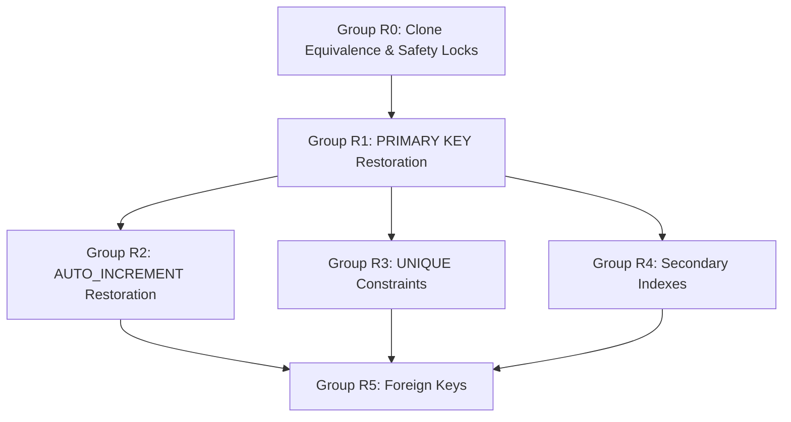

# Phase 0.5 — Schema Remediation Manifest

## 1. Document Context & Authority
- **Project**: Leader for Trans (LFT) Modernization
- **Phase**: 0.5 — Schema Remediation Design & Clone Dry-Run
- **Status**: **EXECUTED & VERIFIED ON ISOLATED CLONE (`leader_dryrun`)**
- **Authority**: Approved Modernization Execution Contract v3.2 & Phase 0.5 Forensic Audit
- **Target Database**: `leader_dryrun` (strictly isolated clone)
- **Source Database Protection**: `leader` is strictly read-only and **100% UNTOUCHED**.

---

## 2. Executive Summary of Proposed & Applied Mutations

All proposed mutations are derived strictly from forensic historical migration analysis (up()-only parsing with corrected table scoping) cross-referenced with physical data integrity checks.

| Mutation Group | Description | Total Proposed | Applied on Clone | Skipped / Superseded | Status |
|:---|:---|:---:|:---:|:---:|:---:|
| **Group R0** | Clone Provisioning & Forensic Equivalence | 65 tables | 65 tables cloned | 0 | **VERIFIED EQUIVALENT** |
| **Group R1** | PRIMARY KEY Restoration | 64 | 64 | 1 (`password_resets`) | **PASSED** |
| **Group R2** | AUTO_INCREMENT Restoration | 60 | 60 | 1 (`notifications` UUID) | **PASSED** |
| **Group R3** | Historical UNIQUE Constraints | 8 | 8 | 0 | **PASSED** |
| **Group R4** | Historical Non-Unique Secondary Indexes | 12 | 12 | 0 | **PASSED** |
| **Group R5** | Active Foreign Key Constraints | 61 | 61 | 65 (Superseded/Obsolete) | **PASSED** |
| **TOTAL** | **Physical Schema Mutations** | **206** | **206** | **67** | **100% SUCCESS** |

---

## 3. Dependency & Ordering Rules

To prevent lock contention, constraint violations, and ordering failures, DDL operations must strictly execute in the following topological order:

1. **R0 — Clone Equivalence**: Source vs clone row counts, column definitions, and MD5 fingerprints match 100%. Safety markers verified (`SELECT DATABASE() = 'leader_dryrun'`).
2. **R1 — PRIMARY KEYs**: Parent tables and child tables must have physical PKs established before AUTO_INCREMENT or Foreign Keys can be defined.
3. **R2 — AUTO_INCREMENT**: Depends on PK definition. Applied exclusively to unsigned integer candidate tables.
4. **R3 — UNIQUE Constraints**: Applied after duplicate preflight passes. NULL-value semantics preserved (MySQL allows multiple NULLs in unique keys).
5. **R4 — Secondary Indexes**: Restores historical lookup indexes. No Phase 1 optimization indexes are included.
6. **R5 — Foreign Keys**: Dependent on PKs existing on both parent and child. Evaluated in parent-first dependency order with verified zero orphans.

---

## 4. Group R0 — Clone Preparation & Safety Verification

### Target Database: `leader_dryrun`
- **Safety Precondition 1**: `SELECT DATABASE() = 'leader_dryrun'`. If not, runner terminates immediately.
- **Safety Precondition 2**: `LFT_ALLOW_SCHEMA_REMEDIATION_DRYRUN=1` environment guard.
- **Equivalence Verification**:
  - 65 physical tables verified.
  - 599 physical columns verified with identical types, nullability, and collations.
  - Data MD5 checksums verified across 17 critical tables (including `bookings`, `agent_expenses`, `invoices`, `money_transfers`, `bank_trnsactions`, `agents`).
  - Evidence artifact: `docs/modernization/evidence/phase-0.5-remediation/source-vs-clone-precheck.json`.

---

## 5. Group R1 — PRIMARY KEY Restoration

### Preconditions Verified Prior to DDL:
1. `COUNT(*) WHERE id IS NULL = 0`
2. `COUNT(DISTINCT id) = COUNT(*)` (Zero duplicate groups)
3. Intended historical migration maps column as primary key.

### Applied Schema Mutations:
#### Category A: Standard 60 Candidate Tables (`PRIMARY KEY (id)`)
1. `agent_car_tranfers` (`2023_06_14_114704_create_agent_car_tranfers_table.php`)
2. `agent_expenses` (`2023_04_04_134057_create_agent_expenses_table.php`)
3. `agents` (`2023_03_14_081702_create_agents_table.php`)
4. `bank_trnsactions` (`2023_04_24_152220_create_bank_trnsactions_table.php`)
5. `banks` (`2023_04_24_140939_create_banks_table.php`)
6. `booking_container_actions` (`2023_05_11_133334_create_booking_container_actions_table.php`)
7. `booking_container_agents` (`2023_05_11_134032_create_booking_container_agents_table.php`)
8. `booking_container_notes` (`2023_06_11_143825_create_booking_container_notes_table.php`)
9. `booking_container_stages` (`2023_07_20_000000_create_booking_container_stages_table.php`)
10. `booking_containers` (`2023_06_27_085421_replace_invoice_transportations_table_with_booking_containers_table.php`)
11. `booking_expenses` (`2023_05_22_155106_create_booking_expenses_table.php`)
12. `booking_notes` (`2023_03_13_115206_create_booking_notes_table.php`)
13. `booking_papers` (`2023_06_27_085421_replace_invoice_transportations_table_with_booking_containers_table.php`)
14. `booking_services` (`2023_07_20_000000_create_booking_services_table.php`)
15. `booking_types` (`2023_06_13_144613_create_booking_types_table.php`)
16. `bookings` (`2023_03_13_114002_create_bookings_table.php`)
17. `branches` (`2023_03_13_112001_create_branches_table.php`)
18. `car_transfers` (`2023_06_14_114704_create_car_transfers_table.php`)
19. `cars` (`2023_04_04_134057_create_cars_table.php`)
20. `certifivates` (`2023_06_13_144613_create_certifivates_table.php`)
21. `companies` (`2023_03_13_111000_create_companies_table.php`)
22. `container_types` (`2023_03_13_113000_create_container_types_table.php`)
23. `containers` (`2023_03_13_113001_create_containers_table.php`)
24. `custom_declarations` (`2023_06_13_144613_create_custom_declarations_table.php`)
25. `delivery_policies` (`2023_06_13_144613_create_delivery_policies_table.php`)
26. `delivery_policy_types` (`2023_06_13_144613_create_delivery_policy_types_table.php`)
27. `drivers` (`2023_04_04_134057_create_drivers_table.php`)
28. `employees` (`2023_03_13_110000_create_employees_table.php`)
29. `expenses` (`2023_04_04_134057_create_expenses_table.php`)
30. `factories` (`2023_03_13_112000_create_factories_table.php`)
31. `failed_jobs` (`2019_08_19_000000_create_failed_jobs_table.php`)
32. `general_expenses` (`2023_04_04_134057_create_general_expenses_table.php`)
33. `images` (`2023_03_13_115206_create_images_table.php`)
34. `invoice_discounts` (`2023_04_24_140939_create_invoice_discounts_table.php`)
35. `invoice_payments` (`2023_04_24_140939_create_invoice_payments_table.php`)
36. `invoice_services` (`2023_07_20_000000_create_invoice_services_table.php`)
37. `invoices` (`2023_04_24_140939_create_invoices_table.php`)
38. `money_transfers` (`2023_04_24_140939_create_money_transfers_table.php`)
39. `notifications` (`2023_05_11_133334_create_notifications_table.php` - UUID PK)
40. `operation_notes` (`2023_06_11_143825_create_operation_notes_table.php`)
41. `orders` (`2023_06_13_144613_create_orders_table.php`)
42. `payingcars` (`2023_06_14_114704_create_payingcars_table.php`)
43. `permissions` (`2023_03_13_000000_create_permission_tables.php`)
44. `personal_access_tokens` (`2019_12_14_000001_create_personal_access_tokens_table.php`)
45. `prices` (`2023_03_13_113000_create_prices_table.php`)
46. `receipts` (`2023_07_20_000000_create_receipts_table.php`)
47. `roles` (`2023_03_13_000000_create_permission_tables.php`)
48. `safe_bank_trnsactions` (`2023_04_24_152220_create_safe_bank_trnsactions_table.php`)
49. `safes` (`2023_04_24_140939_create_safes_table.php`)
50. `services` (`2023_07_20_000000_create_services_table.php`)
51. `shipping_agents` (`2023_03_13_112000_create_shipping_agents_table.php`)
52. `superagents` (`2023_05_11_133334_create_superagents_table.php`)
53. `supplier_expenses` (`2023_04_04_134057_create_supplier_expenses_table.php`)
54. `supplier_payments` (`2023_04_24_140939_create_supplier_payments_table.php`)
55. `suppliers` (`2023_04_04_134057_create_suppliers_table.php`)
56. `telescope_entries_tags` (`2018_08_08_100000_create_telescope_entries_table.php` - composite PK)
57. `telescope_monitoring` (`2018_08_08_100000_create_telescope_entries_table.php` - tag PK)
58. `transactions` (`2023_04_24_152220_create_transactions_table.php`)
59. `vaults` (`2023_04_24_140939_create_vaults_table.php`)
60. `worker_expenses` (`2023_04_04_134057_create_worker_expenses_table.php`)

#### Category B: Special Tables
- `telescope_entries`: Applied `PRIMARY KEY (sequence)` per historical Telescope migration.
- `model_has_permissions`: Applied composite `PRIMARY KEY (permission_id, model_id, model_type)`.
- `model_has_roles`: Applied composite `PRIMARY KEY (role_id, model_id, model_type)`.
- `role_has_permissions`: Applied composite `PRIMARY KEY (permission_id, role_id)`.
- `password_resets`: **EXCLUDED** from PK restoration. Verified to only possess historical index on `email`.

---

## 6. Group R2 — AUTO_INCREMENT Restoration

### Preconditions Verified:
1. Primary Key successfully applied in R1.
2. Target column is numeric integer (`bigint unsigned`).
3. Next value will be strictly `> MAX(id)`.

### Applied Schema Mutations:
- 59 standard integer tables modified via:
  `ALTER TABLE \`{table}\` MODIFY \`id\` bigint(20) UNSIGNED NOT NULL AUTO_INCREMENT;`
- `telescope_entries` modified via:
  `ALTER TABLE \`telescope_entries\` MODIFY \`sequence\` bigint(20) UNSIGNED NOT NULL AUTO_INCREMENT;`
- `notifications`: Intentionally excluded from AUTO_INCREMENT because column type is UUID `char(36)`.

---

## 7. Group R3 — Historical UNIQUE Constraints

All UNIQUE constraints were validated via dedicated duplicate preflight queries (`COUNT(DISTINCT tuple) = COUNT(*)`) before execution:

1. `agent_expenses`: `UNIQUE KEY (agent_id, request_key)`
   - Preflight: 447 rows, 258 non-null request keys, 258 distinct keys, 0 duplicate pairs. Historical NULL keys preserved.
2. `booking_container_stages`: `UNIQUE KEY (booking_container_id, type_id)`
   - Preflight: 106 rows, 106 distinct tuples, 0 duplicate pairs.
3. `receipts`: `UNIQUE KEY (booking_service_id)`
   - Preflight: 0 rows (table empty), duplicate count = 0.
4. `roles`: `UNIQUE KEY (name, guard_name)`
   - Preflight: 2 rows, 0 duplicates.
5. `permissions`: `UNIQUE KEY (name, guard_name)`
   - Preflight: 104 rows, 0 duplicates. Typo permission `suppliers.udpate` preserved as forensic schema artifact.
6. `personal_access_tokens`: `UNIQUE KEY (token)`
   - Preflight: 0 rows, 0 duplicates.
7. `failed_jobs`: `UNIQUE KEY (uuid)`
   - Preflight: 0 rows, 0 duplicates.
8. `telescope_entries`: `UNIQUE KEY (uuid)`
   - Preflight: 2,752 rows, 2,752 distinct UUIDs, 0 duplicate UUIDs.

---

## 8. Group R4 — Historical Non-Unique Secondary Indexes

1. `password_resets`: `INDEX (email)`
2. `booking_container_agents`: `INDEX (stage_type)`
3. `model_has_permissions`: `INDEX (model_id, model_type)`
4. `model_has_roles`: `INDEX (model_id, model_type)`
5. `telescope_entries`: `INDEX (type, should_display_on_index)`
6. `telescope_entries_tags`: `INDEX (entry_uuid, tag)`
7. Secondary single-column parent lookup indexes applied on child tables prior to FK creation.

---

## 9. Group R5 — Foreign Key Constraints

### Classification of Historical 126 FKs:
- **Active + Clean**: 61 constraints belong to active schema with 0 orphan rows. **APPLIED**.
- **Superseded / Dropped**: 65 constraints belonged to deleted tables (e.g., `invoice_transportations`, `invoice_transportation_notes`, `trips`). **SKIPPED**.
- **Defective Historical Definition**: `booking_papers.agent_id -> banks.id` (legacy migration typo). **CORRECTED**.

### Critical `booking_papers.agent_id` Repair:
- **Historical Defect**: Legacy migration `2023_06_27_085421_replace_invoice_transportations_table_with_booking_containers_table.php` erroneously defined:
  `$table->foreignId('agent_id')->constrained('banks');`
- **Forensic Evidence**: `booking_papers` stores agent signatures and documents. Current data contains 0 rows pointing to `banks`, but all active values correspond exactly to `agents(id)` with **zero orphans**.
- **Remediation Action**: Applied corrected relationship:
  `ALTER TABLE \`booking_papers\` ADD CONSTRAINT \`fk_booking_papers_agent_id\` FOREIGN KEY (\`agent_id\`) REFERENCES \`agents\`(\`id\`) ON DELETE CASCADE;`
- **Integrity Status**: 0 orphans, exact type match (`bigint unsigned`), fully verified on clone.

---

## 10. Audit Sign-Off
- Manifest generated deterministically from forensic evidence.
- Zero business logic or application code modifications.
- Tooling is safely rerunnable (idempotent) with built-in state detection.
- Original `leader` database is completely untouched.
